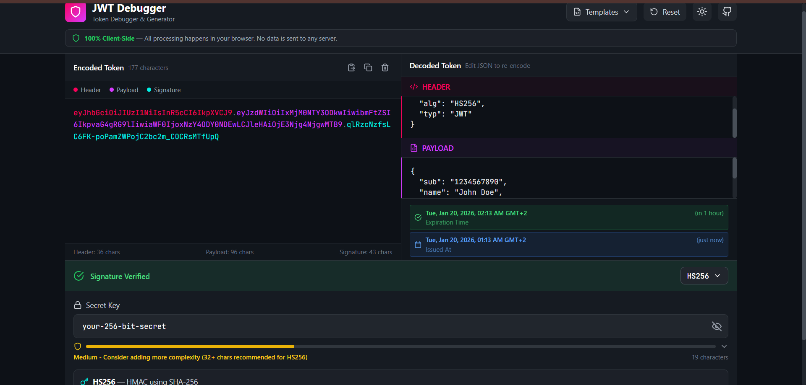

# JWT Token Debugger & Generator

A modern, client-side JWT (JSON Web Token) debugger and generator built with React, similar to jwt.io but with enhanced features and improved security focus.


## 📸 Screenshot



## 🔐 Security First

**100% Client-Side** — All JWT encoding, decoding, and verification happens entirely in your browser. No data is ever sent to any server.

## ✨ Features

### Core Features
- **Split-Screen Editor** — View encoded token on the left, decoded payload on the right
- **Live Editing** — Real-time synchronization between encoded and decoded views
- **Algorithm Support** — HS256, HS384, HS512 (symmetric) and RS256, RS384, RS512, ES256, ES384, ES512, PS256, PS384, PS512 (asymmetric)
- **Signature Verification** — Instant validation with visual feedback

### Smart Features
- **Human-Readable Dates** — Automatic conversion of `exp`, `iat`, `nbf`, `auth_time` timestamps with expiration status
- **Payload Templates** — Quick-fill presets for Auth0, Firebase, AWS Cognito, Google OAuth, Microsoft Azure AD, and more
- **Secret Strength Meter** — Visual indicator for HS256 secret key strength with security recommendations
- **Key Pair Generation** — Generate RSA/ECDSA key pairs directly in the browser

### UI/UX
- **Dark Theme** — Eye-friendly dark mode design
- **Color-Coded Tokens** — Header (pink), Payload (purple), Signature (cyan)
- **Responsive Design** — Works on desktop and mobile devices
- **Copy/Paste Buttons** — Quick clipboard operations

## 🚀 Getting Started

### Prerequisites
- Node.js 18+ 
- npm or yarn

### Installation

```bash
# Clone or navigate to the project directory
cd jwt-debugger

# Install dependencies
npm install

# Start development server
npm run dev
```

The app will be available at `http://localhost:3000`

### Build for Production

```bash
npm run build
npm run preview
```

## 📁 Project Structure

```
jwt-debugger/
├── public/
│   └── jwt-icon.svg          # App icon
├── src/
│   ├── components/
│   │   ├── editor/
│   │   │   ├── EncodedPanel.jsx    # Left panel - encoded token
│   │   │   ├── DecodedPanel.jsx    # Right panel - header/payload
│   │   │   └── SignatureSection.jsx # Bottom - algorithm & keys
│   │   ├── features/
│   │   │   ├── DateDisplay.jsx     # Human-readable dates
│   │   │   ├── TemplateSelector.jsx # Payload templates dropdown
│   │   │   └── SecretStrengthMeter.jsx # Secret strength indicator
│   │   └── layout/
│   │       └── Header.jsx          # App header
│   ├── hooks/
│   │   ├── useJwt.js              # Main JWT state management
│   │   └── useSecretStrength.js   # Password strength calculation
│   ├── utils/
│   │   ├── jwtUtils.js            # JWT encode/decode/verify functions
│   │   ├── dateUtils.js           # Timestamp formatting
│   │   └── templates.js           # Payload templates
│   ├── App.jsx                    # Main app component
│   ├── main.jsx                   # Entry point
│   └── index.css                  # Global styles
├── package.json
├── vite.config.js
├── tailwind.config.js
└── postcss.config.js
```

## 🛠️ Tech Stack

- **React 18** — UI framework
- **Vite** — Build tool
- **Tailwind CSS** — Styling
- **jose** — JWT encoding/decoding/verification
- **Lucide React** — Icons

## 📋 Supported JWT Templates

| Template | Description |
|----------|-------------|
| Standard JWT | Basic JWT with common claims |
| Auth0 | Auth0 ID Token format |
| Firebase | Firebase ID Token format |
| AWS Cognito | AWS Cognito ID Token format |
| Google OAuth | Google ID Token format |
| Microsoft Azure AD | Azure AD Access Token format |
| API Gateway | Generic API access token |

## 🎨 Color Scheme

- **Header** — Pink (#fb015b)
- **Payload** — Purple (#d63aff)
- **Signature** — Cyan (#00f2e6)

## 📝 Usage Tips

1. **Paste a JWT** — Paste any JWT token in the left panel to decode it
2. **Edit Payload** — Modify the JSON in the right panel to re-encode
3. **Verify Signature** — Enter your secret key to verify the signature
4. **Use Templates** — Select a template to quickly populate common JWT formats
5. **Check Expiration** — Look for the human-readable date badges on `exp`, `iat`, `nbf` fields

## 🔒 Security Notes

- This tool is 100% client-side — your tokens never leave your browser
- Never share production secrets or private keys
- Use strong secrets (32+ characters) for HS256 tokens
- Generated key pairs are for testing only — use proper PKI for production

## 📄 License

MIT License — feel free to use and modify for your projects.

## 🤝 Contributing

Contributions are welcome! Please feel free to submit a Pull Request.
